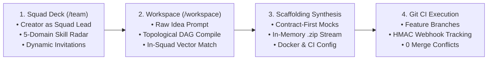
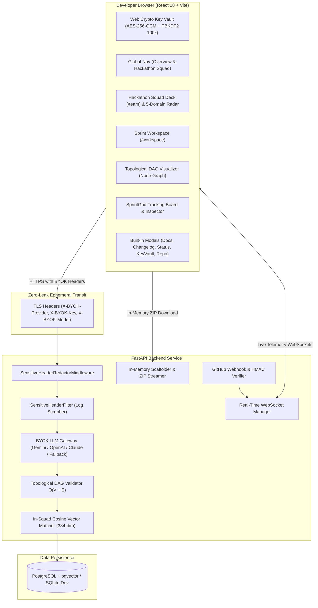

# Daedalus AI

> Autonomous Hackathon Co-Pilot & Real-Time Sprint Orchestration Platform

Daedalus AI eliminates integration conflicts, stack mismatches, and manual progress tracking during fast-paced software hackathons and engineering sprints. It decomposes raw project ideas into verified, acyclic task dependency graphs (DAGs), matches developers to workstreams using vector embeddings of GitHub commit histories, synthesizes production-ready repository boilerplates on the fly, and verifies task completion via GitHub Webhooks and CI/CD pipelines.

---

## Key Pillars

### 1. Frictionless Zero-Knowledge BYOK & Multi-AI Gateway
- **Transparent Client-Side Encryption**: User API keys are encrypted directly in the browser via the native **Web Crypto API** using **AES-256-GCM** and **PBKDF2** (100,000 SHA-256 iterations) with origin and device-unique random salt.
- **Frictionless Direct Access**: Instant access to configure and test provider keys without annoying master PIN lockout screens or presentation barriers.
- **Zero Server Persistence**: Plaintext keys are never written to disk, databases, or cookies. Keys travel only through ephemeral in-memory TLS headers (`X-BYOK-Provider`, `X-BYOK-Key`, `X-BYOK-Model`) during decomposition calls.
- **Sensitive Header Redactor Middleware**: Automatically scrubs `X-BYOK-Key`, `X-BYOK-Token`, and `Authorization` headers from response payloads and applies regex filters to prevent raw API keys from appearing in server logs.
- **Multi-Provider Support**: Direct REST adapters for **Google Gemini** (`gemini-3.6-flash`, `gemini-3.6-pro`), **OpenAI** (`gpt-4o-mini`, `gpt-4o`), **Anthropic Claude** (`claude-3-5-sonnet-20241022`), and **GitHub Personal Access Tokens**.
- **Panic Shredder**: Instant 1-click cryptographic purge destroying all ciphertexts and salt material from local storage.

### 2. Any-Project Idea Decomposer (8 Domain Archetypes)
- Parses requirements across 8 core archetypes:
  - **Web3 & DeFi**: Flash-loan receivers, mempool WebSocket listeners, Subgraph liquidity indexers, multi-call contract simulators.
  - **AI & Medical RAG**: Biomedical XML parsers, dense vector hybrid indexes, citation grounding, RAGAS evaluation gates.
  - **CRDT & Collaborative Real-Time**: Yjs state synchronization, 60fps canvas renderers, cursor presence engines, offline IndexedDB persistence.
  - **Fintech & High-Throughput Payments**: Kafka transaction ingestion, isolation forest anomaly scoring, double-entry SQL ledgers, reconciliation workers.
  - **Healthcare & Emergency Triage**: MQTT telemetry ingestors, NEWS2 vital anomaly scoring, hospital capacity coordinators, HL7/FHIR exports.
  - **DevTools & eBPF Observability**: Kernel probe telemetry, OTEL gRPC tracing collectors, flamegraph visualizers, latency alert managers.
  - **Mobile & IoT**: BLE device discovery, sensor telemetry, and offline-first client architectures.
  - **High-Concurrency E-Commerce**: Distributed inventory locks, redis feed caching, and transactional checkout state machines.
- **Topological Invariant Verification**: Every decomposition mathematically verifies graph acyclicity ($O(V + E)$) via Kahn's algorithm before computing metrics, preventing infinite loops on cyclic dependencies. If an AI provider fails or is rate-limited, the system falls back seamlessly to the deterministic engine.

### 3. Dynamic Task Splitting Engine
- 1-Click task decomposition when bottlenecks arise mid-sprint:
  - **Frontend / Backend Split**: Decouples UI & state hooks (`React, TypeScript, Tailwind`) from backend endpoints and schema validation (`FastAPI, Python, SQL`).
  - **Core Logic / Automated Testing Split**: Isolates core algorithmic execution from test suites (`Pytest, Jest, CI/CD`).
  - **Parallel Micro-Track Split**: Horizontally divides large milestones into concurrent subtasks.
  - **Custom Split**: Flexible developer-specified subtask definitions.
- **Topological Invariant Rewiring**: Upstream dependencies attach to child subtasks, while downstream dependencies wait for all children. Retires parent tasks and verifies zero DAG cycle introduction.
- **Vector Auto-Reassignment**: Recalculates 384-dimensional embeddings for subtasks and matches the best teammate using cosine similarity.

### 4. Contract-First Mock API Engine & Multi-File Code Inspector
- Auto-generates type-safe mock API endpoints and response payloads based on sprint task specifications, unblocking frontend engineers immediately.
- **Syntax-Valid Python AST Scaffolding**: Code generator guarantees valid Python literals (`True`, `False`, `None`) avoiding runtime `NameError` crashes.
- **Interactive Multi-File Code Inspector**: Consumes real in-memory file trees and full code contents from `/api/v1/projects/scaffold/{id}/preview` across 18+ repository files with language syntax badges and line counts.
- **Instant In-Memory ZIP Streaming**: Downloads runnable starter boilerplates (FastAPI backend, React frontend, Docker Compose, and GitHub Actions CI) via `/api/v1/projects/scaffold/{id}/download` without artificial client delays.

### 5. Verified Developer Identity & Production Auth
- **Real Backend Authentication**: Powered by `POST /api/v1/users/login` and `POST /api/v1/users/signup`.
- **Verified GitHub Identity**: Ingests permanent GitHub user IDs (`github_id`), official profile avatars, and display names directly from the GitHub REST API.
- **1-Click Team Member Quick Switcher**: Instant switching between active developer profiles (Alex Chen, Sarah Connor, Marcus Aurelius, Elena Rostova) for fast sprint demonstrations.
- **Ergonomic 2-Column Interface**: Spacious desktop layout (`max-w-4xl`) with an interactive 15-avatar palette picker, streamlined role competency selection (`Frontend Engineer`, `Backend Engineer`, `AI Engineer`, `DevOps Engineer`), and concise, clean copy.
- **5-Domain Competency Radar**: Measures competencies objectively across **Frontend**, **Backend**, **Database**, **DevOps**, and **AI/Data**.
- **Strict In-Squad Task Matchmaking**: Project roadmaps and decomposed tasks are assigned exclusively to members within the active hackathon squad, eliminating clutter from unassociated users.

### 6. Git-Driven CI Webhook State Machine & Repo Connection
- **Repository Connection**: Connect any GitHub repository URL (`PATCH /api/v1/projects/{id}/repo`) for automatic CI webhook configuration.
- **Automated State Transitions**: Listens to GitHub Webhook events (`push`, `pull_request`, `check_run`) verified via HMAC-SHA256 signatures.
- Automatically transitions tasks from `IN_PROGRESS` to `COMPLETED` when CI test runs pass, broadcasting sub-second updates over WebSockets.

### 7. Integrated Developer Modals & Telemetry
- **Interactive Documentation (`DocsModal`)**: In-app architectural specs, 60-second quickstarts, and Docker deployment guides accessible from anywhere.
- **Changelog & Releases (`ChangelogModal`)**: Interactive version history detailing new sprint features and architecture updates.
- **Live Diagnostic Telemetry (`StatusModal`)**: Real-time browser benchmarks measuring live HTTP roundtrip latency (`/health`), database query roundtrip (`/api/v1/users`), Web Crypto key generation speed, and active WebSocket connection state.
- **Frictionless BYOK Key Vault (`KeyVaultModal`)**: Client-side AES-256-GCM encrypted API key manager with 1-click Panic Shredder.
- **Universal Command Palette (⌘K / Ctrl+K)**: Instant fuzzy-search navigation across workspaces, squad roster, templates, and actions.

---

## End-to-End Sprint Lifecycle



---

## System Architecture



> 📖 **Deep-Dive Subsystem Documentation**:
> - [**Backend Engineering Guide & API Architecture** (`backend/README.md`)](backend/README.md)
> - [**Frontend Engineering Guide & Component Hierarchy** (`frontend/README.md`)](frontend/README.md)


---

## Tech Stack

| Layer | Technologies |
| :--- | :--- |
| **Frontend** | React 18, TypeScript, Vite, TailwindCSS, Framer Motion, Lucide Icons |
| **Backend** | Python 3.12, FastAPI, Pydantic v2, SQLAlchemy 2.0 (Async), HTTPX |
| **Cryptographic Security** | Web Crypto API (AES-256-GCM, PBKDF2), HMAC-SHA256, Starlette Middleware |
| **AI Providers** | Google Gemini (3.6 Flash / Pro), OpenAI (GPT-4o), Anthropic (Claude 3.5), GitHub PAT |
| **Data Storage** | PostgreSQL with `pgvector` (production), SQLite via `aiosqlite` (resilient dev fallback) |
| **DevOps** | Docker, Docker Compose, GitHub Actions CI/CD |

---

## Getting Started

### Prerequisites
- Python 3.11 or 3.12
- Node.js 18+ and npm
- (Optional) Docker & Docker Compose

---

### Option A: Local Host Development

#### 1. Start the Backend

```bash
cd backend

# Create and activate virtual environment
python -m venv venv

# Windows:
.\venv\Scripts\activate
# macOS/Linux:
# source venv/bin/activate

# Install dependencies
pip install -r requirements.txt

# Run database migrations / seed data and start server
python main.py
```

* Backend server runs at `http://localhost:8000`
* Interactive API Documentation (Swagger): `http://localhost:8000/docs`
* OpenAPI JSON Specification: `http://localhost:8000/openapi.json`

#### 2. Start the Frontend

```bash
cd frontend

# Install dependencies
npm.cmd install

# Start Vite development server
npm.cmd run dev
```

* Frontend application runs at `http://localhost:5173`

---

### Option B: Docker Compose

```bash
docker compose up --build
```

Services:
- **Frontend**: `http://localhost:3000`
- **Backend**: `http://localhost:8000`
- **PostgreSQL (pgvector)**: `localhost:5432`

---

## API Endpoints Reference

### Authentication & Developer Profiles
- `POST /api/v1/users/login`: Authenticates with username/email and returns developer profile and assigned task count.
- `POST /api/v1/users/signup`: Registers new developer profile, fetches verified `github_id` and avatar from GitHub REST API, and initializes role competencies with vector embeddings.
- `GET /api/v1/users`: Lists available developer profiles with skill vectors.
- `POST /api/v1/users/scan-skills`: Scans public GitHub commit ASTs and returns parsed skill vectors.

### BYOK & Key Security
- `POST /api/v1/byok/validate`: Non-destructive live authentication probe returning latency in milliseconds and available model catalogs.
- `GET /api/v1/byok/providers`: Metadata catalog of supported AI providers, model IDs, and security policy guarantees.

### Decomposition & Graph Orchestration
- `POST /api/v1/projects/decompose`: Generates full epic/task breakdown and DAG dependencies from raw idea prompts. Supports BYOK credentials and optional `squad_context` (`squad_id`, `squad_name`, `team_user_ids`) for strict in-squad task allocation.
- `GET /api/v1/projects/{project_id}`: Retrieves complete project state, task list, epics, and computed sprint metrics.
- `POST /api/v1/projects/{project_id}/tasks/{task_id}/split`: Splits a task into parallel subtasks and automatically updates the dependency DAG.
- `POST /api/v1/projects/{project_id}/tasks`: Adds a custom milestone task to an existing epic.
- `PATCH /api/v1/projects/tasks/{task_id}`: Updates task properties (such as `required_skills`) and dynamically recalculates skill embeddings.
- `DELETE /api/v1/projects/{project_id}/tasks/{task_id}`: Removes a task and safely reconciles dependencies.

### Scaffolding & Code Generation
- `GET /api/v1/projects/scaffold/{project_id}/preview`: Generates complete file tree and starter file previews in-memory with full code content for all files.
- `GET /api/v1/projects/scaffold/{project_id}/download`: Streams runnable boilerplate `.zip` archive bundle in-memory.
- `PATCH /api/v1/projects/{project_id}/repo`: Connects GitHub repository URL for automated CI webhook tracking.

### Hackathon Squads & Team Matching
- `GET /api/v1/users/team/match`: Analyzes hackathon squad composition with skill radar metrics.
- `GET /api/v1/users/team/invitations`: Lists pending and historical squad invitations.
- `POST /api/v1/users/team/invitations`: Dispatches persistent join invitation to a teammate.
- `POST /api/v1/users/team/invitations/{invite_id}/respond`: Accepts or declines a squad invitation.
- `DELETE /api/v1/users/team/invitations/{invite_id}`: Revokes or cancels a pending squad invitation.

### Webhooks & WebSockets
- `POST /api/v1/webhooks/github`: Ingests GitHub push/check_run webhook events verified via HMAC-SHA256 signatures.
- `WS /api/v1/ws`: Real-time bi-directional WebSocket connection for instant sprint updates (also accessible at root `/ws`).

---

## Security Architecture & Zero-Knowledge Guarantee

1. **Client-Side Isolation**: Raw API keys never touch local persistent storage unencrypted. Keys are encrypted with a device-unique AES-256-GCM key derived on the client.
2. **Ephemeral Transit**: Keys are dispatched exclusively in TLS headers (`X-BYOK-Key`, `X-BYOK-Provider`, `X-BYOK-Model`) for prompt execution and immediately dereferenced in volatile memory.
3. **Zero Server Logging**: `SensitiveHeaderFilter` intercepts logging streams and replaces key patterns (`AIzaSy...`, `sk-...`, `ghp_...`) with `...[REDACTED]`.
4. **Header Stripping**: `SensitiveHeaderRedactorMiddleware` ensures that sensitive credential headers are scrubbed before HTTP response delivery.
5. **Instant Purge**: The Panic Shredder wipes all cryptographic keys and salts from browser storage with a single click.

---

## Verification & Testing

### Automated Backend Tests
Run all 31 unit and integration tests:

```bash
cd backend
python -m pytest tests/ -v
```

Test Coverage (31 Passed, 100% Pass Rate):
- `test_api_endpoints.py`:
  - `test_root_endpoint`: Root health probe and service metadata.
  - `test_health_endpoint`: Database connection status.
  - `test_list_users`: Developer profiles retrieval and serialization.
  - `test_skill_scanning_ingestion`: GitHub commit AST parsing & vector ingestion.
  - `test_project_decomposition_and_retrieval`: End-to-end roadmap compile & retrieval.
  - `test_webhook_simulation`: Automated CI state transitions via webhooks.
  - `test_team_matching_and_profile`: Skill compatibility & radar metrics.
  - `test_task_splitting_and_dag_mutation`: Subtask decomposition & DAG edge rewiring.
  - `test_team_invitations_workflow`: Dynamic squad invites & status lifecycle.
  - `test_squad_restricted_decomposition`: Strict in-squad task matchmaking constraint.
  - `test_task_update_skill_persistence`: Task skill update and vector embedding recalculation.
  - `test_decompose_input_validation`: Input validation handling (empty title 422, invalid user 400).
  - `test_webhook_hmac_verification`: Timing-safe HMAC-SHA256 signature verification and tamper rejection (401).
  - `test_user_auth_login_workflow`: Profile authentication and 404 handling.
  - `test_user_auth_signup_and_relogin_workflow`: New developer registration, GitHub identity resolution, skill seeding, and immediate login.
- `test_byok.py`: Provider catalog, live validation probes, mock LLM gateways, header redactor middleware, and sensitive log scrubbing filters.
- `test_daedalus.py`: Vector embeddings, cosine similarity, topological DAG acyclic ordering, Kahn's algorithm cycle prevention, domain archetype detection (all 8 covered), scaffolding ZIP generation, and Python AST syntax validity verification.

### Frontend Production Build
Compile TypeScript and verify bundle assets:

```bash
cd frontend
npm.cmd run build
```

Production Asset Bundle:
```
dist/index.html                         1.72 kB │ gzip:  0.82 kB
dist/assets/index-*.css                55.31 kB │ gzip:  9.51 kB
dist/assets/ui-vendor-*.js            147.62 kB │ gzip: 44.94 kB
dist/assets/react-vendor-*.js         178.89 kB │ gzip: 58.76 kB
dist/assets/index-*.js                394.18 kB │ gzip: 95.71 kB
✓ built in ~3s with 0 TypeScript errors
```

---

## License

MIT License. Designed and engineered for high-velocity software hackathons.
