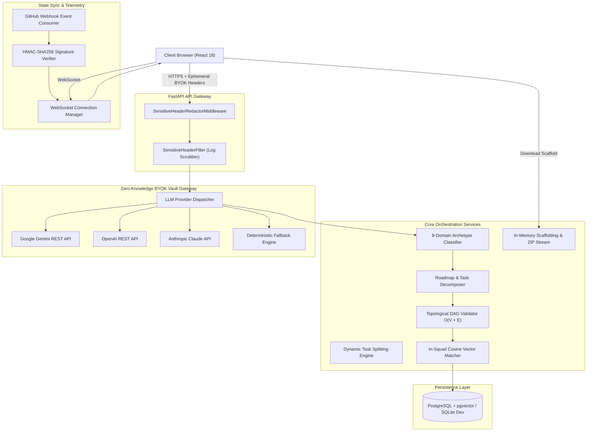
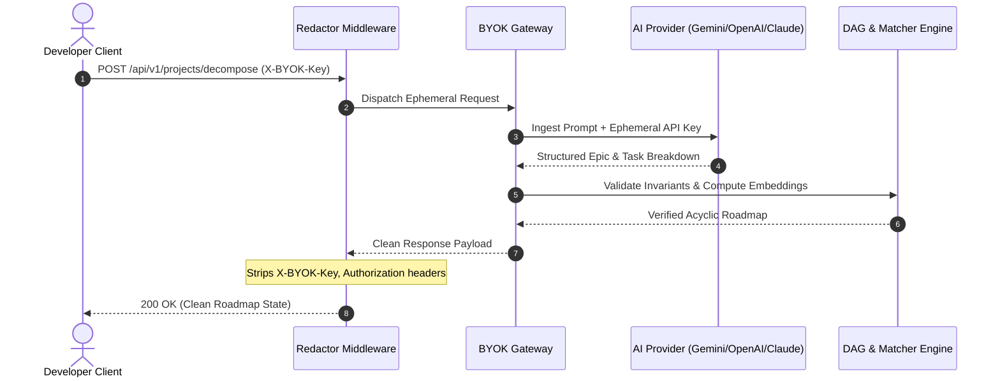
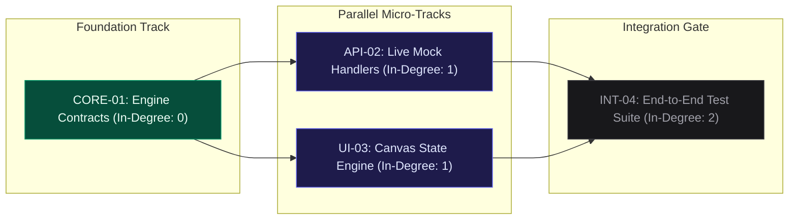
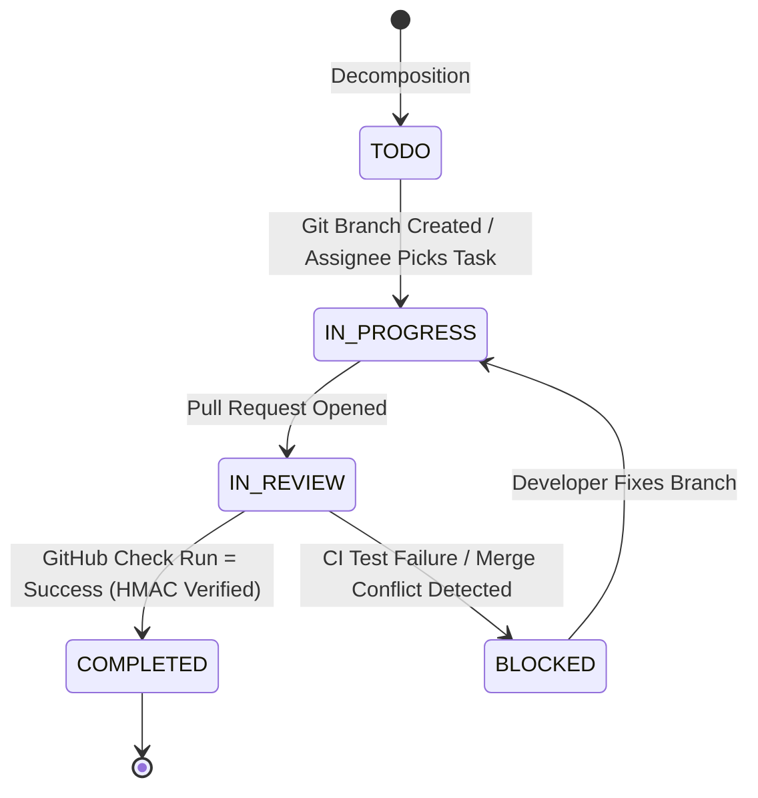

# Daedalus AI - Backend Service

> High-Performance Async Python / FastAPI Engine for Real-Time Sprint Orchestration

The Daedalus backend is built with Python 3.12, FastAPI, and SQLAlchemy 2.0 Async. It provides zero-knowledge BYOK AI gateway proxying, in-squad vector matchmaking via 384-dimensional skill embeddings, mathematical topological DAG verification, in-memory repository scaffolding synthesis, and real-time GitHub webhook state synchronization over WebSockets.

---

## Architecture Overview



---

## Key Backend Capabilities

### 1. Zero-Knowledge BYOK Proxying & Middleware
- **Ephemeral Header Transit**: Reads `X-BYOK-Provider`, `X-BYOK-Key`, and `X-BYOK-Model` exclusively in-memory for the duration of prompt execution. Plaintext keys are never written to disk or stored in database tables.
- **SensitiveHeaderRedactorMiddleware**: Automatically removes all sensitive authentication and credential headers from outgoing HTTP response bodies.
- **SensitiveHeaderFilter**: Standard library Python logging filter intercepts logging output and redacts known API key patterns (`AIzaSy...`, `sk-...`, `ghp_...`).



---

### 2. Topological DAG Verification & Cycle Elimination
- Models project tasks as vertices ($V$) and dependencies as directed edges ($E$).
- Computes in-degree metrics and runs topological ordering in $O(V + E)$ time.
- Guarantees $0$ circular dependencies, discovers parallel tracks, and calculates critical path depth before tasks enter sprint execution.



---

### 3. Strict In-Squad Vector Matchmaking
- Computes 384-dimensional dense vector embeddings using lightweight token frequency and semantic domain projection.
- **In-Squad Scoping**: When a project is linked to an active hackathon squad (`team_user_ids` or `squad_member_ids`), candidate matchmaking queries are strictly constrained to that squad's members.
- Matches subtasks to teammates using cosine similarity:

$$\text{Cosine Similarity} = \frac{\mathbf{u} \cdot \mathbf{v}}{\|\mathbf{u}\| \|\mathbf{v}\|}$$

---

### 4. In-Memory Scaffolding & ZIP Streaming
- Generates a full, runnable starter repository directly in-memory using `io.BytesIO` and `zipfile.ZipFile`:
  - **FastAPI backend** (`main.py`, requirements, health check endpoints, mock routers).
  - **React 18 frontend** (`Vite`, `TailwindCSS`, pre-wired API hooks).
  - **Docker Compose** (`docker-compose.yml` for database, cache, backend, and frontend).
  - **GitHub Actions CI** (`.github/workflows/ci.yml` verifying linting and tests).
- Endpoints:
  - `GET /api/v1/projects/scaffold/{id}/preview`: Returns recursive file tree and code previews.
  - `GET /api/v1/projects/scaffold/{id}/download`: Delivers `.zip` archive via `StreamingResponse`.

---

### 5. Git-Driven CI Webhook State Machine
- Verifies incoming payloads using HMAC-SHA256 and the project's webhook secret.
- Automatically transitions tasks from `IN_PROGRESS` to `COMPLETED` when CI checks pass.
- Emits real-time state mutations over WebSockets to all connected squad peers.



---

## Directory Structure

```text
backend/
├── app/
│   ├── api/
│   │   └── v1/
│   │       ├── endpoints/
│   │       │   ├── byok.py             # Key validation & provider catalog
│   │       │   ├── decomposition.py    # Idea decomposition & task splitting
│   │       │   ├── scaffolding.py      # Starter repo preview & zip stream
│   │       │   ├── users.py            # Developer auth, profiles, squad invites & AST scanner
│   │       │   ├── webhooks.py         # GitHub HMAC webhook receiver
│   │       │   └── ws.py               # WebSocket sprint update subscription
│   │       └── router.py               # Combined v1 API router
│   ├── core/
│   │   ├── config.py                   # Environment settings, CORS & security defaults
│   │   ├── security.py                 # Core cryptographic hashing & secrets
│   │   └── security_middleware.py      # Sensitive header redactor & log filter
│   ├── db/
│   │   ├── models.py                   # SQLAlchemy async models (User, Task, Epic, TeamInvitation)
│   │   └── session.py                  # Database engine, sessions & idempotent schema migrations
│   └── services/
│       ├── ai_provider.py              # Multi-provider LLM gateway (Gemini, OpenAI, Claude, PAT)
│       ├── decomposer.py               # 8-domain archetype templates & topological DAG validator
│       ├── embeddings.py               # 384-dim word-boundary token embeddings & cosine matcher
│       ├── git_tracker.py              # Git webhook state transitions & branch tracking
│       ├── scaffolding_engine.py       # In-memory starter repo synthesis (AST syntax-valid)
│       └── ws_manager.py               # Real-time WebSocket connection hub
├── tests/
│   ├── conftest.py                     # Pytest async fixtures & SQLite in-memory DB
│   ├── test_api_endpoints.py           # Auth, routing, decomposition & squad tests (15 tests)
│   ├── test_byok.py                    # Gateway probes, middleware & redaction (5 tests)
│   └── test_daedalus.py                # Graph invariants, archetypes & AST scaffolding (11 tests)
├── daedalus_dev.db                     # Resilient local SQLite development database
├── main.py                             # Server entrypoint, dual WS mount & lifecycle
└── requirements.txt                    # Python dependencies
```

---

## Getting Started

### 1. Prerequisites
- Python 3.11 or 3.12
- `pip` package manager

### 2. Setup Virtual Environment

```bash
cd backend

# Create virtual environment
python -m venv venv

# Windows:
.\venv\Scripts\activate
# macOS/Linux:
# source venv/bin/activate

# Install dependencies
pip install -r requirements.txt
```

### 3. Start Development Server

```bash
python main.py
```

- Server URL: `http://localhost:8000`
- Interactive Swagger UI: `http://localhost:8000/docs`
- OpenAPI JSON: `http://localhost:8000/openapi.json`
- Real-time WebSockets: `ws://localhost:8000/api/v1/ws` (and `ws://localhost:8000/ws`)

---

## Verification & Testing

The backend includes a comprehensive, automated test suite covering routing, security, graph theory, vector mathematics, authentication workflows, and in-squad task isolation:

```bash
python -m pytest tests/ -v
```

### Test Suite Breakdown (31 Tests, 100% Pass Rate)

| Test Module | Test Name | Focus Area |
| :--- | :--- | :--- |
| `test_api_endpoints.py` | `test_root_endpoint` | Root service health & metadata |
| `test_api_endpoints.py` | `test_health_endpoint` | Database connection status |
| `test_api_endpoints.py` | `test_list_users` | Developer profile query & serialization |
| `test_api_endpoints.py` | `test_skill_scanning_ingestion` | GitHub commit AST parsing & vector ingestion |
| `test_api_endpoints.py` | `test_project_decomposition_and_retrieval` | End-to-end roadmap compile & retrieval |
| `test_api_endpoints.py` | `test_webhook_simulation` | HMAC verification & CI state progression |
| `test_api_endpoints.py` | `test_team_matching_and_profile` | Skill compatibility & synergy calculation |
| `test_api_endpoints.py` | `test_task_splitting_and_dag_mutation` | Subtask decomposition & DAG edge rewiring |
| `test_api_endpoints.py` | `test_team_invitations_workflow` | Dynamic squad invites & status handling |
| `test_api_endpoints.py` | `test_squad_restricted_decomposition` | Strict in-squad task matchmaking constraint |
| `test_api_endpoints.py` | `test_task_update_skill_persistence` | Task skill modification & embedding recalculation |
| `test_api_endpoints.py` | `test_decompose_input_validation` | Empty title (422) & missing squad ID (400) validation |
| `test_api_endpoints.py` | `test_webhook_hmac_verification` | Timing-safe HMAC verification & tamper rejection (401) |
| `test_api_endpoints.py` | `test_user_auth_login_workflow` | Profile sign-in (200) & non-existent user handling (404) |
| `test_api_endpoints.py` | `test_user_auth_signup_and_relogin_workflow` | Developer signup, skill seeding & immediate relogin |
| `test_byok.py` | `test_byok_providers_catalog` | Catalog metadata & model listings |
| `test_byok.py` | `test_byok_validate_invalid_key` | Live non-destructive validation probe |
| `test_byok.py` | `test_byok_validate_mock_success` | Provider mock authentication simulation |
| `test_byok.py` | `test_security_header_redactor_middleware` | Header stripping on HTTP responses |
| `test_byok.py` | `test_sensitive_header_filter_logging` | Log stream regex redaction filter |
| `test_daedalus.py` | `test_embeddings_dimension_and_norm` | 384-dimensional vector normalization |
| `test_daedalus.py` | `test_cosine_similarity` | Cosine similarity bounds $[0, 1]$ |
| `test_daedalus.py` | `test_dag_acyclic_validation` | Cycle elimination & topological ordering |
| `test_daedalus.py` | `test_project_decomposition_structure` | Epic/task hierarchy & invariants |
| `test_daedalus.py` | `test_scaffolding_zip_generation` | In-memory ZIP archive generation & structure |
| `test_daedalus.py` | `test_detect_project_domain` | 8-domain archetype pattern detection |
| `test_daedalus.py` | `test_calculate_dag_metrics` | Parallel tracks & critical path depth |
| `test_daedalus.py` | `test_split_task_in_dag` | Invariant-preserving subtask graph rewiring |
| `test_daedalus.py` | `test_calculate_dag_metrics_cycle_prevention` | Kahn's algorithm upfront cycle rejection (no infinite loop) |
| `test_daedalus.py` | `test_scaffolding_python_ast_syntax_validity` | Python AST validation for generated scaffold files |
| `test_daedalus.py` | `test_domain_archetypes_all_covered` | All 8 archetype templates produce domain-specific task codes |
