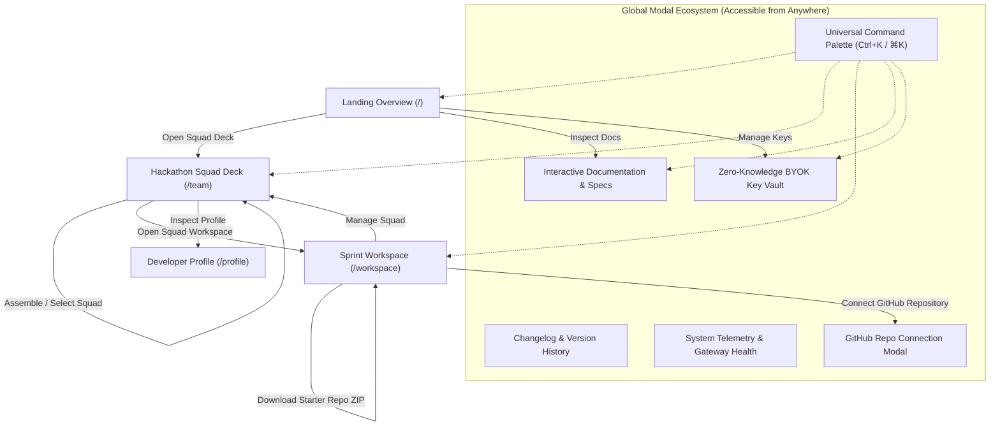
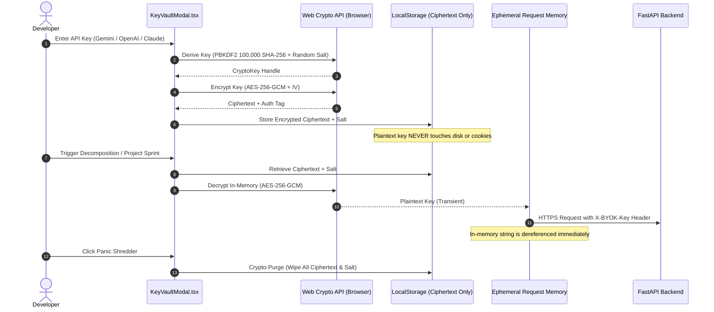

# Daedalus AI - Frontend Application

> High-Velocity React 18 / TypeScript Interface for Autonomous Hackathon Orchestration

The Daedalus frontend is an ultra-fast, developer-first single-page application built with React 18, TypeScript, Vite, TailwindCSS, and Framer Motion. It features client-side zero-knowledge encryption for AI keys, an interactive topological DAG canvas, dynamic in-squad task splitting, a real-time 5-domain competency radar, and sub-second WebSocket updates.

---

## User Flow & View Architecture



---

## Security Architecture: Client-Side Zero-Knowledge Vault



---

## Key Frontend Systems

### 1. The Hackathon Squad Deck (`/team`)
- **Squad Creator Leadership**: When a user creates a squad, they are automatically assigned as the **Squad Leader** (`👑 SQUAD LEAD (YOU)`), added as member 1, and protected from removal.
- **5-Domain Competency Radar**: SVG spider chart visualizes collective coverage across **Frontend**, **Backend**, **Database**, **DevOps**, and **AI/Data**. Hovering over applicant candidates triggers real-time impact simulations with dashed projection polygons.
- **Universal Entry Point**: Squad cards feature direct **`"Open {squad.name} Workspace →"`** buttons, eliminating conditional state confusion and guaranteeing immediate in-squad focus.

---

### 2. Topological Node Graph (`NodeGraphView.tsx`)
- Visualizes the project task dependency graph (DAG) in real-time.
- Supports **Pan**, **Zoom**, **Minimap**, and **1-Click Fullscreen Maximize Mode**.
- Automatically colors tasks by execution state:
  - 🟣 **Backlog / Queued**: Waiting on upstream prerequisites.
  - 🔵 **In Progress**: Active execution track.
  - 🟡 **In Review**: Pull request submitted.
  - 🟢 **Done / Merged**: CI test suite green.
  - 🔴 **Blocked**: Dependency or test failure.

---

### 3. Sprint Grid & Dynamic Task Splitting (`WorkspaceView.tsx`)
- **Real-Time Kanban**: Synchronizes instant task status mutations across connected peers via WebSockets.
- **Task Splitting Engine**: When a bottleneck task arises mid-sprint, clicking **"Split Task"** opens a dedicated wizard to decompose the task into:
  - **Frontend / Backend Split** (e.g. React view + FastAPI endpoint).
  - **Core Logic / Automated Testing Split** (e.g. Core implementation + Pytest suite).
  - **Parallel Micro-Tracks** (concurrent child workstreams).
- Retires the parent task and re-wires incoming/outgoing dependency edges with mathematical acyclic verification.

---

### 4. Zero-Friction Idea Editor (`IdeaEditor.tsx`)
- **Blank-by-Default**: Opens with clean inputs ready for the developer's unique hackathon idea, with zero pre-filled template text.
- **Archetype Presets**: 8 optional domain chips (`AI / RAG`, `Web3 / DeFi`, `CRDT / Realtime`, `Fintech`, `Healthcare`, `DevTools`, `IoT`, `E-Commerce`) provide instant architecture blueprints.

---

### 5. Verified Developer Auth & Profile Experience (`AuthModal.tsx`, `AvatarPicker.tsx`)
- **Real Backend Authentication**: Authenticates against `POST /api/v1/users/login` and registers new developer profiles via `POST /api/v1/users/signup`.
- **1-Click Quick Switch**: Teammate selector chips at the top allow instant switching between active profiles (Alex Chen, Sarah Connor, Marcus Aurelius, Elena Rostova) for fast demo presentations.
- **Ergonomic 2-Column Desktop Layout**:
  - **Left Panel**: Real-time developer identity preview card and 15-choice avatar palette picker (`AvatarPicker.tsx`) with category filters (`Bots`, `Pixel`, `Shapes`).
  - **Right Panel**: Spacious form inputs for full name, GitHub handle, email, and password (with show/hide eye toggle), plus streamlined role selection (`Frontend Engineer`, `Backend Engineer`, `AI Engineer`, `DevOps Engineer`).
- **Clean Developer Copy**: Concise labels ("Sign In", "Create Profile") without verbose clutter or over-explanation.

---

### 6. Interactive Multi-File Code Inspector (`ZippingFolder3D.tsx`)
- Consumes real in-memory file trees and code contents from `/api/v1/projects/scaffold/{id}/preview`.
- Inspects all 18+ synthesized repository files (`main.py`, `package.json`, `docker-compose.yml`, `requirements.txt`, `README.md`, etc.) with language syntax badges, line counts, and instant copy-to-clipboard.
- Instant, non-blocking in-memory `.zip` archive download.

---

### 7. Live System Telemetry & Diagnostics (`StatusModal.tsx`)
- Probes real-time HTTP roundtrip latency against `/health`.
- Benchmarks database query roundtrip response times via `/api/v1/users`.
- Benchmarks client-side Web Crypto API (`crypto.subtle`) key generation execution time.
- Verifies live bi-directional WebSocket connection status.

---

## Component Directory Breakdown

```text
frontend/src/
├── components/
│   ├── auth/
│   │   └── AuthModal.tsx              # Ergonomic 2-column developer sign-in / sign-up modal
│   ├── common/
│   │   ├── AvatarPicker.tsx           # 15-choice categorized avatar selection palette
│   │   ├── ConfettiBurst.tsx          # Micro-celebration trigger on task completion
│   │   ├── GlassCard.tsx              # Reusable dark glass card component
│   │   ├── MagneticButton.tsx         # Snappy hardware-accelerated interaction button
│   │   └── SkeletonLoader.tsx         # Shimmering content placeholder
│   ├── dashboard/
│   │   ├── SprintGrid.tsx             # Kanban task board with status columns
│   │   ├── TaskCard.tsx               # Individual task card with assignee avatar
│   │   ├── TeammateAvatar.tsx         # Circular avatar with status dot
│   │   └── WebhookSimulator.tsx       # Live webhook simulation dispatcher
│   ├── decomposer/
│   │   ├── IdeaEditor.tsx             # Spec input editor & preset chips
│   │   ├── NodeGraphView.tsx          # Interactive SVG DAG visualizer
│   │   └── TaskSidePanel.tsx          # Task detail & in-squad assignee drawer
│   ├── landing/
│   │   ├── BentoGrid.tsx              # Architecture specifications & code snippets
│   │   ├── ClimaxCTA.tsx              # Footer call-to-action bar
│   │   ├── HackathonComparison.tsx    # 24-Hour Reality Check comparison matrix
│   │   ├── HeroMasterpiece.tsx        # Main landing hero with live cockpit inspector
│   │   ├── LandingPage.tsx            # Master landing page layout
│   │   ├── MasterpieceFooter.tsx      # Comprehensive developer directory footer
│   │   └── TechDeepDiveFAQ.tsx        # System architecture & developer FAQ
│   ├── modals/
│   │   ├── ChangelogModal.tsx         # Version releases & git commit history
│   │   ├── CommandPalette.tsx         # Universal search & jump (Ctrl+K / ⌘K)
│   │   ├── DocsModal.tsx              # Fullscreen architectural documentation
│   │   ├── KeyVaultModal.tsx          # AES-256-GCM zero-knowledge BYOK key manager
│   │   ├── RepoConnectModal.tsx       # GitHub repository linker & suggestions
│   │   └── StatusModal.tsx            # Live diagnostic benchmarks & telemetry
│   ├── onboarding/
│   │   └── DirectOnboarding.tsx       # Quick developer handle initialization
│   ├── profile/
│   │   └── UserProfile.tsx            # Developer profile, skills & commit timeline
│   ├── scaffolding/
│   │   ├── BuildSequence.tsx          # Step-by-step code generation visualizer
│   │   └── ZippingFolder3D.tsx        # Multi-file code inspector & ZIP synthesis
│   ├── team/
│   │   └── TeamRoster.tsx             # Squad Deck, 5-domain radar & squad creator
│   └── workspace/
│       ├── CreateTaskModal.tsx        # Custom milestone task creation modal
│       ├── SplitTaskModal.tsx         # Task decomposition & edge rewiring wizard
│       └── WorkspaceView.tsx          # Central sprint orchestration arena
├── services/
│   ├── api.ts                         # HTTP client for REST endpoints
│   ├── cryptoVault.ts                 # Web Crypto AES-256-GCM & PBKDF2 vault
│   └── websocket.ts                   # WebSocket client with heartbeat reconnection
├── types/
│   └── index.ts                       # Complete TypeScript interfaces & schemas
├── App.tsx                            # Root application & routing orchestrator
├── main.tsx                           # DOM entrypoint
└── index.css                          # Tailwind CSS imports & custom styles
```

---

## Getting Started

### 1. Prerequisites
- Node.js 18+ or 20+
- `npm` package manager

### 2. Installation & Development

```bash
cd frontend

# Install dependencies
npm.cmd install

# Start Vite dev server with hot module replacement (HMR)
npm.cmd run dev
```

Application runs at `http://localhost:5173`.

### 3. Production Build & Verification

```bash
# Type-check TypeScript & compile optimized production bundle
npm.cmd run build

# Preview production build locally
npm.cmd run preview
```

---

## Keyboard Shortcuts

| Shortcut | Action |
| :--- | :--- |
| `Ctrl+K` / `⌘K` | Open Universal Command Palette |
| `Ctrl+Enter` / `⌘Enter` | Submit Project Idea or Create Squad Form |
| `Esc` | Close any active modal / side drawer |
